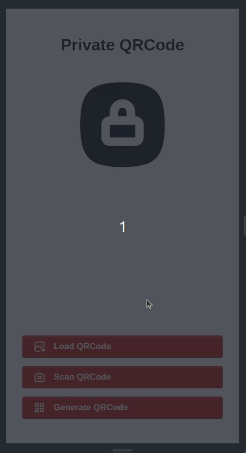
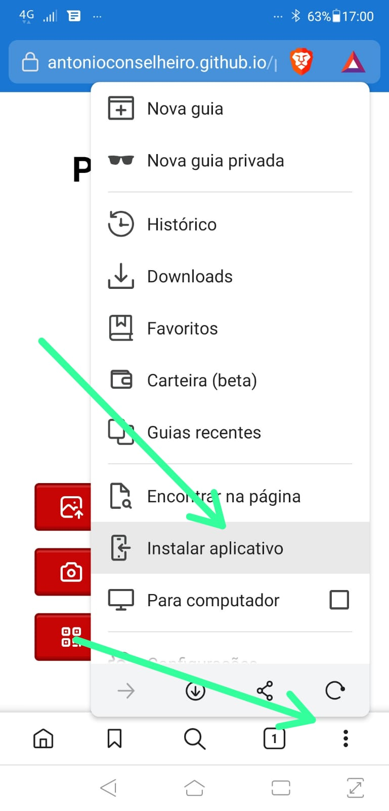

> "He that hath an ear, let him hear what the Spirit saith unto the
> churches; To him that overcometh will I give to eat of the hidden
> manna, and will give him a white stone, and in the stone a new name
> written, which no man knoweth saving he that receiveth it."
> Apocalipse 2:17

# Private QRCode
Store your secrets encrypted and printed in qrcode format, use this tool to generate private qrcode with key and to open this private qrcode using this key.
It's open source and work offline.

[CLICK HERE TO RUN APP](https://antonioconselheiro.github.io/private-qrcode)

## Cypherpunk
> [...]
> 
> Cypherpunks write code. We know that someone has to write software
> to defend privacy, and since we can't get privacy unless we all do,
> we're going to write it. We publish our code so that our fellow
> Cypherpunks may practice and play with it. Our code is free for all
> to use, worldwide. We don't much care if you don't approve of the
> software we write. We know that software can't be destroyed and that
> a widely dispersed system can't be shut down. 
> 
> [...]
>
> The Cypherpunks are actively engaged in making the networks safer for
> privacy.  Let us proceed together apace.
> 
> Onward.
> Eric Hughes, <hughes@soda.berkeley.edu>
>
> [Cypherpunk Manifesto](https://nakamotoinstitute.org/static/docs/cypherpunk-manifesto.txt)

## Usage
### Generate Private QRCode
Encrypt your personal info with a key

### Open Private QRCode
Not your keys, not your qrcode

## Install
Open [https://antonioconselheiro.github.io/private-qrcode](https://antonioconselheiro.github.io/private-qrcode)

## Donate
There's still a lot of work to do.

Lighting donate: <a href="lightning:peevedbeer57@walletofsatoshi.com">lightning:peevedbeer57@walletofsatoshi.com</a>

Bitcoin onchain donate: <a href="bitcoin:bc1qrm99lmmpwk7zsh7njpgthw87yvdm38j2lzpq7q">bc1qrm99lmmpwk7zsh7njpgthw87yvdm38j2lzpq7q</a>

## Contribute
[CONTRIBUTE.md](./CONTRIBUTE.md)
